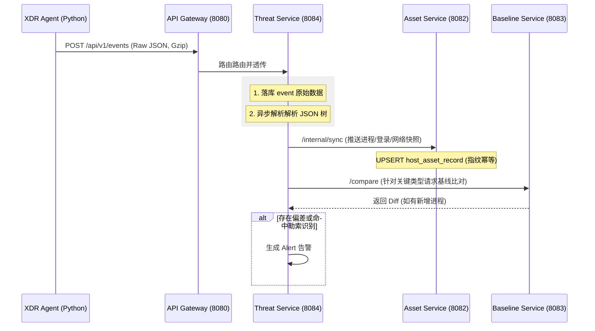

# XDR 平台接口设计详解 (API Detailed Design)

本接口文档定义了 XDR 平台各微服务间（端-边-云）的契约规范与核心业务处理流。

---

## 1. 全量 API 索引 (API Reference)

### 1.1 资产服务 (`asset-service` : 8082)
| 方法 | 路径 | 功能描述 | 输入 | 输出样例 |
| :--- | :--- | :--- | :--- | :--- |
| GET | `/api/v1/assets` | 分页查询资产列表 | page, size, keyword, osType, unit, responsiblePerson | `PageResponse<Asset>` |
| GET | `/api/v1/assets/{agentId}/details` | **核心**：获取聚合画像(前端分页) | agentId | `AssetDetailDTO` (含进程/流量/USB) |
| GET | `/api/v1/assets/topology` | 获取网络连接拓扑 | - | `GraphDTO` (Nodes/Edges) |
| GET | `/api/v1/assets/timeline` | **时光机**：查询历史快照 | agentId, [timestamp] | `List<HostAssetRecord>` |
| POST | `/api/v1/assets/{agentId}/user-info` | 绑定终端负责人信息 | `UserInfo` JSON | `ApiResponse<Void>` |
| POST | `/api/v1/assets/internal/sync` | **内部接口**：威胁服务推送快照 | `SyncAssetRequest` | 处理 ADD/REMOVE/FULL 逻辑聚合 |

### 1.2 资产同步 DTO: `SyncAssetRequest`
```json
{
  "agentId": "uuid",
  "assetType": "PROCESS",
  "reportType": "INCREMENTAL/FULL",
  "items": [
    {
      "fingerprint": "hash",
      "action": "ADD/REMOVE", 
      "data": { ... }
    }
  ]
}
```

### 1.2 威胁服务 (`threat-service` : 8084)
| 方法 | 路径 | 功能描述 | 输入 | 核心逻辑 |
| :--- | :--- | :--- | :--- | :--- |
| POST | `/api/v1/events` | **Agent 主入口**：上报事件 | `Map<String, Object>` | 异步解析，写入 Event 库，触发 Alert 检查 |
| GET | `/api/v1/alerts` | 获取告警清单 | level, status, agentId, unit, responsiblePerson | 分页返回结构化告警 |
| GET | `/api/v1/alerts/{id}` | 获取告警详情 | alertId | 包含触发原因及原始数据摘要 |
| PUT | `/api/v1/alerts/{id}/status` | 处置操作：确认/忽略 | status, operator, comment | 更新告警生命周期状态 |

### 1.3 基线服务 (`baseline-service` : 8083)
- `GET /api/v1/baselines`: 获取基线清单 (入参: type, unit, responsiblePerson)。
- `POST /learn`: 开启学习窗口（默认 168 小时）。
- `POST /compare`: 实时输入当前快照，返回差异项 (`diff`)。
- `POST /approve`: 审核学习结果，将其固化为 V1 版 Active 基线。

### 1.4 策略服务 (`policy-service` : 8085)
- `GET /commands/pending/{agentId}`: Agent 轮询接口，获取待下发的拦截任务。
- `PUT /commands/{commandId}/status`: Agent 回传指令执行结果（成功/失败/异常）。

---

## 2. 核心业务逻辑流程 (Core Flows)

### 2.1 Agent 数据上报历程 (The Life of an Event)


### 2.2 响应与处置链路 (Manual Response Flow)
1. **控制台发现**: 管理员在 `Alert` 中看到高危恶意进程。
2. **人工处突**: 管理员点击“立即阻断”。
3. **指令分发**: `threat-service` 调用 `policy-service` 创建一个 `KILL_PROCESS` 指令。
4. **Agent 拉取**: Agent 在下一轮询周期 (10s) 调用 `/commands/pending` 检出该指令。
5. **本地执行**: Agent 调用 `psutil` 强制杀除 PID。
6. **闭环反馈**: Agent 调用 `PUT /status` 回传结果，控制台更新告警为“已处置”。

---

## 3. 标准响应结构与错误码

### 3.1 基础 DTO: `ApiResponse<T>`
```java
public class ApiResponse<T> {
    private int code;      // 200: 成功; 401: 未授权; 500: 失败
    private String message;
    private T data;        // 业务对象
}
```

### 3.2 全局错误码映射表
| 错误码 | 含义 | 处理建议 |
| :--- | :--- | :--- |
| **200** | 成功 | - |
| **401** | 未授权 | 检查 Authorization Bearer Token 或 Gateway 白名单 |
| **403** | 权限不足 | 当前角色 (OPERATOR) 无权执行该操作 |
| **404** | 资源不存在 | 检查 agentId 或 ID 是否输入错误 |
| **500** | 系统内部异常 | 查看对应微服务的 `logs/*-error.log` |
| **1001** | 基线尚未建立 | 需先完成学习任务 (`/learn`) 才能进行比对 |
