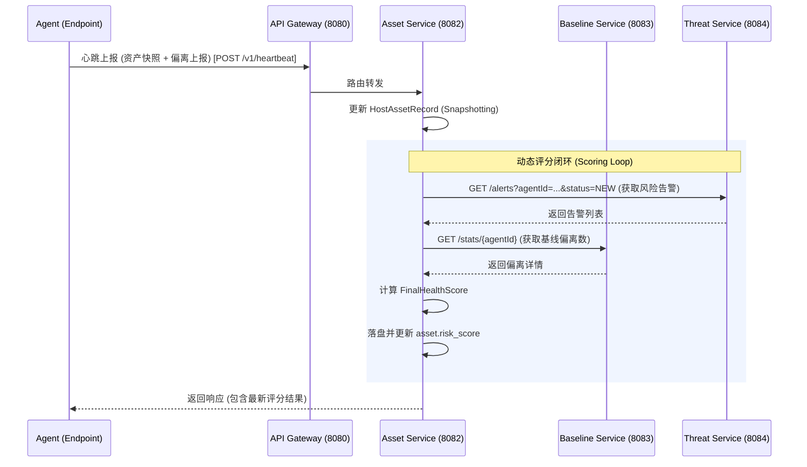

# XDR 平台审计增强功能详细设计 (Audit Enhancement Detailed Design)

## 1. 概述 (Overview)
本次审计增强旨在解决 XDR 平台在资产画像、合规评估及自动化风险量化方面的能力缺失。通过引入“画像级基线”与“动态权重评分”，实现了从被动检测向主动治理的演进。

## 2. 基线画像审计方案 (Baseline Profiling & Auditing)

### 2.1 采集模型 (Collection Model)
传统的端口采集仅记录监听状态，无法识别非法的“借壳”监听。增强后的采集模型引入进程上下文：
- **采集元数据对**：`(LocalPort, Protocol, ProcessName, ExecutablePath)`。
- **Agent 实现**：通过 `psutil` 遍历网络连接，通过 `LADDR` 锁定 `PID`，进而提取进程指纹（MD5/路径）。

### 2.2 基线构建逻辑 (Construction Logic)
系统支持两种基线构建方式：
1. **静态导入 (Static Import)**：根据当前系统状态一键转固。
2. **时序学习 (Temporal Learning)**：
   - **窗口期**：默认为 7 * 24 小时（168 小时）。
   - **算法**：对窗口期内的快照进行频率分析，保留出现频率超过阈值（如 80%）的条目作为最终基线项。

### 2.3 偏离检测算法 (Deviation Detection)
采用**多因子哈希键 (Multi-factor Hash Key)** 进行精确匹配：
- **键构造函数**：`Key = MD5(Port + Protocol + ProcessName)`。
- **比对流程**：
  1. 将当前采集列表转为 Map<Key, Data>。
  2. **新增检测**：`CurrentKey - BaselineKeys` -> 触发 **Baseline Violation ALERT**。
  3. **缺失检测**：`BaselineKeys - CurrentKey` -> 记录为不一致（不触发告警，防止正常停机误报）。
  4. **修改检测**：相同 Key 下的 Data 指纹变动。

## 3. 动态安全评分引擎 (Dynamic Scoring Engine)

### 3.1 评分公式 (Formula)
$$Score = 100 - (\sum W_{alert} \times N_{alert} + \sum W_{baseline} \times N_{violation} + StatusPenalty)$$

### 3.2 权重分布 (Weights)
| 因子类型 (Factor) | 严重度 (Severity) | 扣分 (Weight) | 说明 |
| :--- | :--- | :--- | :--- |
| 威胁告警 (Alert) | CRITICAL | 40 | 勒索、提权等高危行为 |
| 威胁告警 (Alert) | HIGH | 20 | 恶意域名访问等 |
| 威胁告警 (Alert) | MEDIUM | 10 | 异常登录、扫描行为 |
| 基线偏离 (Baseline) | ERROR | 15 | 每关联合法端口的非法物理进程 |
| 在线状态 (Status) | OFFLINE | 5 | 离线资产基础信度下调 |

### 3.3 触发机制
- **同步触发**：心跳包入库后立刻触发 `AssetService.calculateHealthScore()`。
- **数据流转**：`AssetService` 作为汇聚点，通过 RestTemplate 调用 `ThreatService` 获取未处理告警，调用 `BaselineService` 获取最新偏离统计。

## 4. 全链路数据流 (Data Flow)

## 5. 合规审计逻辑 (Compliance Logic)
- **单位维度**：聚合该单位下所有 Agent 的合规项得分，求算加权均值作为部门分。
- **评估项映射**：
  - **GB/T 22239 (等保)**：核心关注项为：入侵防范（基线）、身份鉴别（登录策略）、资源控制（策略）。
  - **ISO 27001**：核心关注项为：资产管理（全量清单）、访问控制。

## 6. 技术栈与持久化
- **DB**：MyBatis-Plus 逻辑删除支持。
- **缓存**：Redis 存储各 Agent 的最新评分缓存，减少跨服务数据库 IO。
- **Client**：使用 Spring Cloud RestTemplate 保证服务间数据一致性。
