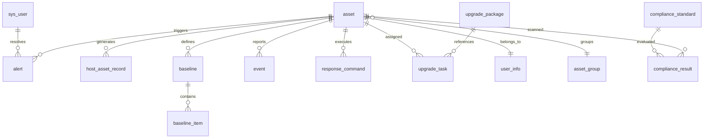

# XDR 平台数据库设计详解 (Database Detailed Design)

本指南为 XDR 全栈微服务平台的物理数据模型参考，旨在为后端逻辑实现及数仓分析提供标准定义。

---

## 1. 逻辑架构与关系 (ER Diagram)

XDR 系统采用物理库级别的微服务隔离，库间通过 `agent_id` 实现逻辑关联。

---

## 2. 数据库详细规格

### 2.1 认证鉴权库 (`xdr_auth`)
**用途**: 存储云端管理平台用户信息及权限根数据。

#### 表: `sys_user` (系统用户表)
| 字段名 | 类型 | 描述 | 约束 |
| :--- | :--- | :--- | :--- |
| `id` | VARCHAR(36) | 全局唯一标识 (UUID) | PRIMARY KEY |
| `username` | VARCHAR(50) | 登录用户名 | UNIQUE, NOT NULL |
| `password` | VARCHAR(255) | BCrypt 加密后的散列值 | NOT NULL |
| `real_name` | VARCHAR(50) | 真实姓名 | - |
| `email` | VARCHAR(100) | 电子邮箱 | - |
| `phone` | VARCHAR(20) | 联系电话 | - |
| `role` | VARCHAR(20) | 用户角色 (ADMIN/AUDITOR/OPERATOR) | DEFAULT 'OPERATOR' |
| `status` | INT | 账户状态 (0-禁用, 1-正常) | DEFAULT 1 |
| `deleted` | INT | 逻辑删除标记 (0/1) | DEFAULT 0 |
| `created_at` | DATETIME | 创建时间 | DEFAULT CURRENT_TIMESTAMP |
| `updated_at` | DATETIME | 更新时间 | ON UPDATE CURRENT_TIMESTAMP |

---

### 2.2 资产管理库 (`xdr_asset`)
**用途**: 维护终端硬件指纹、组织架构及资产时序历史。

#### 表: `asset` (主机资产主表)
| 字段名 | 类型 | 描述 | 约束 |
| :--- | :--- | :--- | :--- |
| `id` | VARCHAR(36) | 逻辑主键 | PRIMARY KEY |
| `agent_id` | VARCHAR(50) | Agent 侧生成的唯一 UUID | UNIQUE, INDEX |
| `hostname` | VARCHAR(100) | 主机名 | - |
| `os_type` | VARCHAR(20) | 操作系统家族 (WINDOWS/KYLIN...) | - |
| `os_version` | VARCHAR(50) | 系统具体版本号 | - |
| `cpu_arch` | VARCHAR(20) | 指令集架构 (x86_64/ARM64) | - |
| `memory_total` | BIGINT | 物理内存总量 (Bytes) | - |
| `disk_total` | BIGINT | 系统盘总量 (Bytes) | - |
| `ip_address` | VARCHAR(50) | 当前上报 IP 地址 | - |
| `status` | VARCHAR(20) | 在线状态 (ONLINE/OFFLINE) | INDEX, DEFAULT 'OFFLINE' |
| `last_heartbeat`| DATETIME | 最近心跳时间 | - |
| `unit` | VARCHAR(100) | 所属单位/部门属性 | INDEX |
| `responsible_person`| VARCHAR(50) | 资产责任人姓名 | INDEX |

#### 表: `host_asset_record` (时序资产快照表)
| 字段名 | 类型 | 描述 | 约束 |
| :--- | :--- | :--- | :--- |
| `id` | VARCHAR(36) | 主键 | PRIMARY KEY |
| `agent_id` | VARCHAR(50) | 关联 Agent ID | INDEX |
| `asset_type` | VARCHAR(20) | 资产类型 (PROCESS/NETWORK/USB) | INDEX |
| `asset_fingerprint`| VARCHAR(255) | 该快照項的唯一指纹 (Hash) | UNIQUE(agent_id, type, fp) |
| `asset_data` | JSON | 采集到的全量属性 JSON | NOT NULL |
| `status` | VARCHAR(20) | 是否活跃 (ACTIVE/INACTIVE) | INDEX |
| `first_seen` | DATETIME | 首次发现时间 | - |
| `last_updated` | DATETIME | 最近更新时间 (保活时间) | - |

> 🧩 **架构注解：端云聚合状态机**
> Agent 端采用“增量上报(`ADD/REMOVE`) + 周期全量(`FULL`)”的轻量上报基准。该表是由后端的 `asset-service` 根据这些指令通过 Upsert 与 Inactive 流转引擎计算出的**终端时序切片**。提取当前设备全貌时，只需 `WHERE status = 'ACTIVE'` 即可。

---

### 2.3 基线管理库 (`xdr_baseline`)
**用途**: 存储学习到的已知稳态配置，用于偏离检测。

#### 表: `baseline` (基线配置主表)
| 字段名 | 类型 | 描述 | 约束 |
| :--- | :--- | :--- | :--- |
| `agent_id` | VARCHAR(50) | 关联 Agent | UNIQUE(agent_id, type) |
| `type` | VARCHAR(20) | 基线维度 (PROCESS/PORT/USB) | NOT NULL |
| `status` | VARCHAR(20) | 学习状态 (LEARNING/ACTIVE) | INDEX |
| `version` | INT | 基线迭代版本 | DEFAULT 1 |
| `unit` | VARCHAR(100) | 所属单位 (用于多租户/部门隔离) | INDEX |
| `responsible_person`| VARCHAR(50) | 责任人 | INDEX |
| `learning_start` | DATETIME | 学习周期起始 | - |

---

### 2.4 威胁分析库 (`xdr_threat`)
**用途**: 接收安全事件流，进行关联分析并持久化告警。

#### 表: `alert` (威胁告警表)
| 字段名 | 类型 | 描述 | 约束 |
| :--- | :--- | :--- | :--- |
| `id` | VARCHAR(36) | 告警 ID | PRIMARY KEY |
| `level` | VARCHAR(20) | 危害等级 (CRITICAL/HIGH...) | INDEX |
| `threat_type` | VARCHAR(50) | 威胁分类 (RANSOMWARE/BASELINE) | - |
| `title` | VARCHAR(200) | 告警标题 | - |
| `raw_event` | JSON | 触发告警的原始 JSON 数据载体 | - |
| `status` | VARCHAR(20) | 处置状态 (NEW/RESOLVED) | INDEX |
| `unit` | VARCHAR(100) | 关联资产所属单位 | INDEX |
| `responsible_person`| VARCHAR(50) | 关联资产责任人 | INDEX |

#### 表: `event` (原始审计日志)
| 字段名 | 类型 | 描述 | 约束 |
| :--- | :--- | :--- | :--- |
| `event_type` | VARCHAR(50) | 采集类型 | INDEX |
| `event_data` | JSON | 原始 JSON 包 | NOT NULL |

---

### 2.5 策略及响应库 (`xdr_policy`)
**用途**: 管理防护规则及针对特定威胁的手动/自动处置动作。

#### 表: `policy` (防护策略表)
- `scope`: GLOBAL(全局), GROUP(分组), AGENT(单机)。
- `content`: 具体的 JSON 防护配置（如：采集频率、开启模块）。

#### 表: `response_command` (响应指令执行表)
| 字段名 | 类型 | 描述 | 约束 |
| :--- | :--- | :--- | :--- |
| `command_type` | VARCHAR(50) | 指令类型 (KILL_PROCESS) | - |
| `status` | VARCHAR(20) | 执行状态 (PENDING/EXECUTED) | INDEX |

---

## 3. JSON Schema 设计规范
对于 `asset_data` 与 `baseline_item`, 采用 JSON 格式以应对长尾属性的变化：
- **PROCESS**: `{"pid": 123, "name": "cmd.exe", "path": "C:\\...", "user": "SYSTEM"}`
- **NETWORK**: `{"local_addr": "0.0.0.0:80", "remote_addr": "null", "status": "LISTENING"}`

---

## 4. 索引设计原则
- **高频谓词索引**: 针对 `agent_id` 及其关联的业务字段 (如 `asset_type`) 建立联合索引 `idx_agent_fp`。
- **状态流转索引**: `idx_status_time` 覆盖 `status` 与 `last_updated`，加速僵死资产清理与统计。
