# XDR平台 Phase 1 MVP 实施计划

基于 [product_design.md](file:///e:/project/xdr-test/product_design.md)，实施Phase 1核心MVP。

## User Review Required

> [!IMPORTANT]
> 本项目涉及**三个子系统**（Agent/后端/前端），全部从零开始搭建。建议按以下顺序逐步推进，每完成一个阶段确认后再继续：
> 1. 后端服务（数据基础）→ 2. Agent终端（数据源）→ 3. 前端界面（数据展示）

> [!WARNING]
> Phase 1聚焦核心功能，以下高级功能**不在本次范围**内：
> - 国产化OS适配（ARM64/LoongArch）
> - 灰度发布/灰度升级
> - 合规管理全流程
> - 攻击链/威胁溯源可视化
> - 第三方集成（SIEM/SOAR/SDK）

---

## Phase 1 MVP 范围

### 后端服务 (xdr-server)

| 模块 | 范围 |
|------|------|
| **api-gateway** | Spring Cloud Gateway统一入口、JWT鉴权 |
| **auth-service** | 用户登录/登出、JWT颁发、Agent注册/认证、RBAC权限 |
| **asset-service** | 资产自动注册、心跳管理、资产列表/详情/分组、在线状态 |
| **baseline-service** | 基线学习(标准7天)、导入创建、5种基线类型CRUD、基线比对、基线下发 |
| **threat-service** | 事件接收预处理、基础告警生成(4级别)、告警状态管理(4状态)、告警列表 |

---

### Agent终端 (xdr-agent)

| 模块 | 范围 |
|------|------|
| **collector** | 进程采集器、网络连接采集器、登录事件采集器 |
| **comparator** | 基线比对引擎（进程/端口基线） |
| **comm** | mTLS通信、心跳上报、分级上报、断网缓存 |
| **core** | 配置管理、日志管理、定时任务调度 |
| **user_info** | 首次安装信息采集(tkinter弹窗)、信息上报 |

---

### 前端界面 (xdr-frontend)

| 页面 | 范围 |
|------|------|
| **登录页** | 用户名密码登录、JWT存储 |
| **仪表盘** | 安全事件统计卡片、告警趋势图、资产健康度 |
| **资产列表** | 资产表格(搜索/筛选/分页)、资产详情侧栏 |
| **告警列表** | 告警表格(按状态/级别筛选)、告警详情弹窗、告警处理 |

---

## Proposed Changes

### 1. 后端服务 (Spring Boot)

#### [NEW] xdr-server 项目结构

```
e:/project/xdr-test/xdr-server/
├── pom.xml                          # 父POM (Spring Boot 3.2 + Spring Cloud 2023)
├── api-gateway/                     # API网关
│   ├── pom.xml
│   └── src/main/java/.../gateway/
│       ├── GatewayApplication.java
│       ├── config/SecurityConfig.java
│       └── filter/JwtAuthFilter.java
├── auth-service/                    # 认证鉴权
│   ├── pom.xml
│   └── src/main/java/.../auth/
│       ├── controller/AuthController.java       # 登录/登出/刷新
│       ├── controller/AgentAuthController.java  # Agent注册/认证
│       ├── service/AuthService.java
│       ├── service/JwtService.java
│       ├── model/User.java, Role.java
│       └── config/SecurityConfig.java
├── asset-service/                   # 资产管理
│   ├── pom.xml
│   └── src/main/java/.../asset/
│       ├── controller/AssetController.java
│       ├── controller/HeartbeatController.java
│       ├── service/AssetService.java
│       ├── model/Asset.java, AssetGroup.java, UserInfo.java
│       └── scheduler/HeartbeatChecker.java      # 离线检测定时任务
├── baseline-service/                # 基线管理
│   ├── pom.xml
│   └── src/main/java/.../baseline/
│       ├── controller/BaselineController.java
│       ├── service/BaselineService.java
│       ├── service/LearningEngine.java          # 基线学习引擎
│       ├── model/Baseline.java, BaselineItem.java
│       └── dto/BaselineDiffDTO.java
├── threat-service/                  # 威胁分析
│   ├── pom.xml
│   └── src/main/java/.../threat/
│       ├── controller/AlertController.java
│       ├── controller/EventController.java      # 事件接收
│       ├── service/AlertService.java
│       ├── service/EventProcessor.java
│       ├── model/Alert.java, Event.java
│       └── enums/AlertLevel.java, AlertStatus.java
└── common/                          # 公共模块
    ├── pom.xml
    └── src/main/java/.../common/
        ├── model/BaseEntity.java
        ├── dto/ApiResponse.java
        ├── exception/GlobalExceptionHandler.java
        └── util/JwtUtil.java
```

**技术栈**：Spring Boot 3.2 + MySQL 8 + MyBatis-Plus + Redis + Spring Cloud Gateway

> [!NOTE]
> Phase 1暂不引入Kafka和Elasticsearch，事件处理直接走REST API同步处理。后续Phase 2再引入消息队列。

---

### 2. Agent终端 (Python)

#### [NEW] xdr-agent 项目结构

```
e:/project/xdr-test/xdr-agent/
├── requirements.txt
├── setup.py
├── config.yaml                      # Agent配置文件
├── main.py                          # 入口
├── agent/
│   ├── __init__.py
│   ├── collector/
│   │   ├── __init__.py
│   │   ├── base.py                  # BaseCollector基类
│   │   ├── process_collector.py     # 进程采集(psutil)
│   │   ├── network_collector.py     # 网络连接采集(psutil)
│   │   └── login_collector.py       # 登录事件采集
│   ├── comparator/
│   │   ├── __init__.py
│   │   └── baseline_comparator.py   # 基线比对引擎
│   ├── comm/
│   │   ├── __init__.py
│   │   ├── comm_manager.py          # 通信管理(requests+mTLS)
│   │   ├── heartbeat.py             # 心跳上报
│   │   └── cache.py                 # 断网缓存(SQLite)
│   ├── core/
│   │   ├── __init__.py
│   │   ├── config.py                # 配置管理(YAML)
│   │   ├── logger.py                # 日志管理
│   │   └── scheduler.py             # 定时任务调度(APScheduler)
│   └── user_info/
│       ├── __init__.py
│       ├── collector_gui.py         # tkinter弹窗采集
│       └── manager.py               # 信息管理(加密存储+上报)
└── tests/
    ├── test_process_collector.py
    └── test_baseline_comparator.py
```

**核心依赖**：`psutil`, `requests`, `pyyaml`, `apscheduler`, `cryptography`

---

### 3. 前端界面 (Vue 3)

#### [NEW] xdr-frontend 项目结构

```
e:/project/xdr-test/xdr-frontend/
├── package.json
├── vite.config.ts
├── tsconfig.json
├── src/
│   ├── App.vue
│   ├── main.ts
│   ├── router/index.ts              # Vue Router路由
│   ├── stores/                      # Pinia状态管理
│   │   ├── auth.ts                  # 认证状态
│   │   └── app.ts                   # 全局状态
│   ├── api/                         # Axios API封装
│   │   ├── request.ts               # Axios实例(JWT拦截器)
│   │   ├── auth.ts
│   │   ├── asset.ts
│   │   └── alert.ts
│   ├── views/
│   │   ├── login/LoginView.vue      # 登录页
│   │   ├── dashboard/DashboardView.vue  # 仪表盘
│   │   ├── asset/AssetListView.vue  # 资产列表
│   │   └── threat/AlertListView.vue # 告警列表
│   ├── components/
│   │   ├── layout/AppLayout.vue     # 主布局(侧边栏+顶栏)
│   │   ├── asset/AssetDetail.vue    # 资产详情侧栏
│   │   └── threat/AlertDetail.vue   # 告警详情弹窗
│   └── styles/
│       └── index.css                # 全局样式
└── .env.development                 # 开发环境API地址
```

**技术栈**：Vite 5 + Vue 3 + TypeScript + Element Plus + ECharts + Pinia + Vue Router 4

---

## 建议开发顺序

```mermaid
graph LR
    A[1. 后端common模块] --> B[2. auth-service]
    B --> C[3. asset-service]
    C --> D[4. baseline-service]
    D --> E[5. threat-service]
    E --> F[6. api-gateway]
    F --> G[7. Agent核心+采集器]
    G --> H[8. Agent通信+心跳]
    H --> I[9. 前端项目初始化]
    I --> J[10. 登录页+布局]
    J --> K[11. 资产列表页]
    K --> L[12. 告警列表页]
    L --> M[13. 仪表盘]
```



---

## Verification Plan

### 自动化测试

1. **后端单元测试**
   ```bash
   cd e:/project/xdr-test/xdr-server
   mvn test
   ```

2. **Agent单元测试**
   ```bash
   cd e:/project/xdr-test/xdr-agent
   python -m pytest tests/ -v
   ```

3. **前端构建验证**
   ```bash
   cd e:/project/xdr-test/xdr-frontend
   npm run build
   ```

### 集成验证（浏览器）
- 启动后端 → 启动前端 → 浏览器打开前端→ 登录 → 查看仪表盘/资产/告警页面
- 启动Agent → 确认心跳上报 → 确认资产自动注册 → 确认采集数据上报

### 手动验证
- 请用户确认各页面UI效果和交互流程
