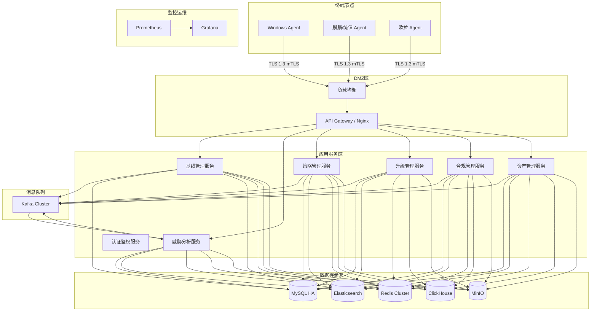
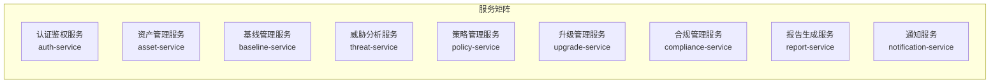
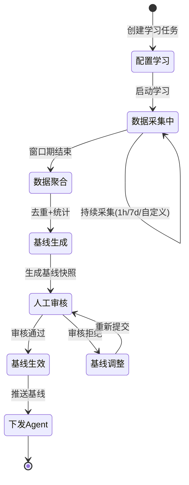
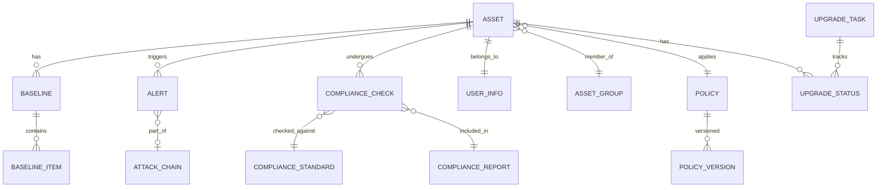
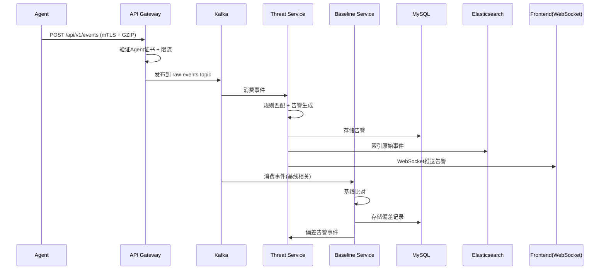
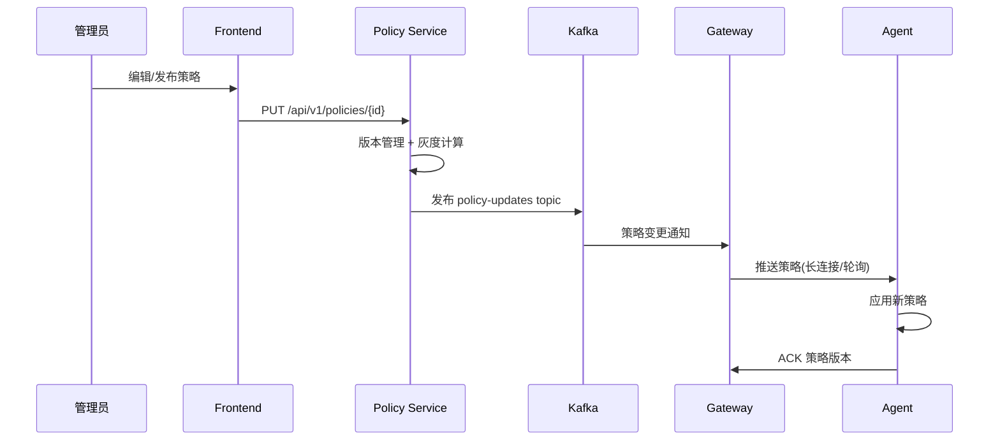

# 网络安全XDR平台 — 产品架构设计文档

**文档版本**：V1.0  
**创建日期**：2026-02-23  
**基于**：《网络安全XDR软件产品需求规格说明书》V4.0

---

## 一、系统总体架构

### 1.1 分层架构

```
┌─────────────────────────────────────────────────────────────────┐
│                      表现层 (Presentation)                       │
│  Vue 3 + TypeScript + Element Plus + ECharts                    │
│  仪表盘 │ 资产视图 │ 威胁视图 │ 合规视图 │ 策略视图 │ 升级视图    │
├─────────────────────────────────────────────────────────────────┤
│                      网关层 (API Gateway)                        │
│  Spring Cloud Gateway + JWT + Rate Limiting                     │
├─────────────────────────────────────────────────────────────────┤
│                      服务层 (Microservices)                      │
│  基线管理 │ 威胁分析 │ 策略管理 │ 升级管理 │ 合规管理 │ 资产管理    │
├─────────────────────────────────────────────────────────────────┤
│                    消息/事件总线 (Event Bus)                      │
│  Apache Kafka (事件流) + Redis (缓存/Pub-Sub)                    │
├─────────────────────────────────────────────────────────────────┤
│                    数据层 (Data Storage)                         │
│  MySQL (业务)      │ Elasticsearch (日志) │ Redis (缓存)          │
│  MinIO (文件存储) │ ClickHouse (时序分析)                         │
├─────────────────────────────────────────────────────────────────┤
│                    基础设施层 (Infrastructure)                    │
│  Docker + K8S │ Prometheus + Grafana │ Nginx │ Vault             │
└─────────────────────────────────────────────────────────────────┘

┌─────────────────────────────────────────────────────────────────┐
│                    终端Agent层 (Endpoint)                        │
│  Python 3.10+ (用户态) + C扩展 (性能关键路径)                    │
│  数据采集 │ 基线比对 │ 威胁检测 │ 响应执行 │ 通信管理              │
└─────────────────────────────────────────────────────────────────┘
```

### 1.2 部署架构



---

## 二、技术选型

### 2.1 技术栈总览

| 层次 | 技术选型 | 选型理由 |
|------|----------|----------|
| **Agent核心** | Python 3.10+ | 跨平台能力强，psutil/watchdog等生态丰富，开发效率高 |
| **Agent性能扩展** | C扩展 (ctypes/cffi) | 内核级Hook、性能关键路径用C扩展补充 |
| **Agent GUI** | tkinter (轻量) / PyQt5 (丰富) | tkinter内置无需额外依赖，PyQt5国产OS兼容好 |
| **Agent打包** | PyInstaller / Nuitka | 打包为单文件可执行程序，无需目标机安装Python |
| **后端框架** | Spring Boot 3.x + Spring Cloud | 成熟企业级生态，微服务支持 |
| **前端框架** | Vue 3 + TypeScript + Element Plus | 中后台企业级方案，国内生态活跃、文档完善 |
| **可视化** | ECharts 5.x | 国产图表库，安全态势展示能力强 |
| **API网关** | Spring Cloud Gateway | 统一入口，限流/鉴权/路由 |
| **消息队列** | Apache Kafka 3.x | 高吞吐事件流，支持事件溯源 |
| **关系数据库** | MySQL 8.0+ | 成熟稳定、国内广泛使用、运维生态完善 |
| **搜索引擎** | Elasticsearch 8.x | 日志全文检索、告警聚合分析 |
| **时序数据库** | ClickHouse | 海量时序数据高速分析 |
| **缓存** | Redis 7.x (Cluster) | 会话缓存、热点数据、Pub/Sub |
| **对象存储** | MinIO | S3兼容，存储升级包/报告文件 |
| **密钥管理** | HashiCorp Vault | 证书管理、密钥轮换、敏感配置 |
| **容器编排** | Docker + Kubernetes | 弹性部署、自动扩缩容 |
| **监控** | Prometheus + Grafana | 服务健康监控、指标采集 |
| **CI/CD** | GitLab CI + Harbor | 自动化构建、镜像管理 |

### 2.2 Agent跨平台打包策略

| CPU架构 | 打包工具 | 目标平台 | 关键依赖 |
|---------|---------|---------|----------|
| x86_64 | PyInstaller --onefile | Windows / 麒麟x86 / 统信x86 / 欧拉 | psutil, watchdog, requests, cryptography |
| ARM64 | PyInstaller (交叉打包) / Nuitka | 麒麟ARM(飞腾) / 统信ARM | 需在目标架构上构建 |
| LoongArch | Nuitka (AOT编译) | 麒麟(龙芯) | 需龙芯Python 3.10+环境 |

> **注意**：Python Agent通过PyInstaller/Nuitka打包为独立可执行文件，目标机器**无需安装Python运行时**。C扩展模块（如内核Hook）随包分发为`.pyd`(Windows)或`.so`(Linux)文件。

---

## 三、终端Agent详细设计

### 3.1 功能总览

#### 3.1.1 系统基础能力

| 功能编号 | 功能名称 | 功能描述 | 优先级 |
|---------|---------|---------|-------|
| A-BASE-001 | 多平台适配 | 支持Windows(7/10/11/Server 2012-2022)和国产OS(麒麟V10+/统信UOS V20+/欧拉openEuler)双平台运行 | P0 |
| A-BASE-002 | 多架构支持 | 支持x86_64、ARM64(飞腾)、LoongArch(龙芯)三种CPU架构 | P0 |
| A-BASE-003 | 轻量化运行 | 安装包≤50MB，常驻内存≤100MB，CPU占用≤5%(平均) | P0 |
| A-BASE-004 | 静默安装 | 支持命令行静默安装，无需用户交互即可完成部署 | P1 |
| A-BASE-005 | 服务自启动 | 系统启动时自动启动Agent服务并保持后台运行 | P0 |
| A-BASE-006 | 防卸载保护 | 内核级/C扩展保护，非管理员权限无法卸载Agent | P0 |
| A-BASE-007 | 防篡改保护 | 关键文件SHA-256完整性校验，检测到篡改立即告警并自动恢复 | P0 |
| A-BASE-008 | 通信加密 | 所有Agent与后端通信使用TLS 1.3+，mTLS双向证书认证 | P0 |
| A-BASE-009 | 防调试保护 | 检测调试器附加行为，触发时自动告警上报 | P2 |

#### 3.1.2 数据采集能力

| Function | Description | Collection Detail | Default Frequency |
|---------|---------|---------|----------|
| A-COLL-001 | 进程采集 | 采集进程完整信息 | PID、进程名、命令行参数、用户名、启动时间(ISO)、CPU/内存占用 | 60s |
| A-COLL-002 | 网络/流量采集 | 采集网络连接与原始流量 | 1. 活跃连接对关联进程PID；2. **混杂模式(Promiscuous Mode)** 采集网络资产访问对 | 60s / 持续监听 |
| A-COLL-003 | USB设备采集 | 监控USB设备插拔 | 厂商ID、产品ID、序列号、操作时间。Win: WMI监听；Linux: lsusb/udev | 实时 |
| A-COLL-004 | 登录事件采集 | 采集登录/注销事件 | 用户名、终端、来源IP、时间。Win: Security Log；Linux: psutil.users/audit | 实时 |
| A-COLL-005 | 资产/软件信息 | 采集硬件与已安装软件 | CPU架构/核心、内存总量、磁盘挂载、已安装软件(Win:注册表; Linux:dpkg/rpm) | 1h |
| A-COLL-006 | 采集频率配置 | 支持后端动态下发采集频率 | 每个采集器可独立配置频率，范围5s~300s | - |
| A-COLL-007 | 增量采集 | 仅上报与上次快照的差异数据 | 通过本地快照diff计算变化项，减少网络传输量 | - |

#### 3.1.3 基线比对能力

| 功能编号 | 功能名称 | 功能描述 |
|---------|---------|----------|
| A-BL-001 | 接收基线配置 | 接收后端下发的基线数据(JSON格式)，本地加密存储 |
| A-BL-002 | 进程基线比对 | 将当前运行进程与进程基线对比，识别新增/缺失/变更进程 |
| A-BL-003 | 端口基线比对 | 将当前监听端口与端口基线对比，识别新增/缺失/变更端口 |
| A-BL-004 | USB基线比对 | 将当前USB设备与USB基线对比，识别非授权设备接入 |
| A-BL-005 | 登录基线比对 | 将登录行为与登录基线对比，识别异常登录(异常时段/异常来源IP) |
| A-BL-006 | 软件基线比对 | 将已安装软件与软件基线对比，识别非授权软件安装/卸载 |
| A-BL-007 | 异常结果上报 | 比对发现异常后，按分级策略(高危实时/中危5min/低危30min)上报至后端 |

#### 3.1.4 威胁检测与响应能力

| 功能编号 | 功能名称 | 功能描述 | 检测方法 |
|---------|---------|---------|----------|
| A-DET-001 | 勒索软件检测 | 实时监控诱饵文件变动 | 部署隐藏诱饵文件 `.sys_cache_info`，使用 `watchdog` 监听非法读写/删除 |
| A-DET-002 | 指令执行审计 | 深度捕获命令行参数 | **Win**: 订阅 Event 4688 并提取 `ProcessCommandLine`；**Linux**: 随动读取 `auditd` 日志 |
| A-DET-003 | 横向攻击识别 | 匹配黑产工具特征 | 实时匹配 PsExec、WMI 远程调用、Mimikatz 等黑名单指令签名 |
| A-DET-005 | IOC比对 | 比对已知威胁指标 | 对网络连接IP/域名、文件Hash与后端下发的IOC列表进行比对 |
| A-DET-006 | 行为状态机检测 | 基于事件序列识别攻击模式 | 将多个单一事件组合为行为链，匹配预定义的攻击模式状态机 |
| A-RESP-001 | 终止恶意进程 | 自动或受控终止检测到的恶意进程 | 调用系统API终止进程，记录进程快照(内存dump可选) |
| A-RESP-002 | 阻断网络连接 | 阻断异常的出站/入站网络连接 | 添加系统防火墙规则(iptables/Windows Firewall)阻断指定IP/端口 |
| A-RESP-003 | 隔离USB设备 | 隔离非授权USB存储设备 | 禁用USB挂载点写入权限或弹出设备 |
| A-RESP-004 | 攻击时间线生成 | 记录攻击全过程形成时间线 | 关联触发检测前后N分钟内的所有采集事件，生成时间戳排序的事件链 |

#### 3.1.5 通信与数据管理能力

| 功能编号 | 功能名称 | 功能描述 |
|---------|---------|----------|
| A-COMM-001 | mTLS安全通信 | 使用TLS 1.3 + 双向证书认证与后端通信 |
| A-COMM-002 | GZIP数据压缩 | 上报数据使用GZIP压缩(压缩率≥70%)以减少带宽占用 |
| A-COMM-003 | 分级上报 | 高危事件实时上报(延迟<1s/全量日志)；中危事件每5分钟汇总上报(摘要)；低危事件每30分钟汇总上报(摘要) |
| A-COMM-004 | 心跳上报 | 每5分钟上报Agent状态(在线/离线、版本号、CPU/内存/磁盘占用) |
| A-COMM-005 | 断网续传 | 网络中断时数据缓存至本地SQLite(≥7天容量)，恢复后按时间顺序补传 |
| A-COMM-006 | 策略接收 | 接收后端下发的检测策略、基线配置、采集频率等配置变更 |
| A-COMM-007 | 升级包下载 | 接收后端下发的升级通知，下载并校验(RSA签名)升级包 |
| A-COMM-008 | 异常状态告警 | 防篡改触发、自保护异常等关键事件实时上报 |

#### 3.1.6 用户信息管理

| 功能编号 | 功能名称 | 功能描述 |
|---------|---------|----------|
| A-USER-001 | 首次安装信息采集 | Windows弹窗/国产OS配置文件方式收集用户姓名、部门、单位名称、手机号、邮箱 |
| A-USER-002 | 信息加密存储 | 用户信息使用AES-256-GCM加密后存入本地SQLite |
| A-USER-003 | 信息自动上报 | 首次安装完成后自动将用户信息上报至后端，与AgentID绑定 |
| A-USER-004 | 查看用户信息 | 用户可通过GUI或命令行查看当前绑定的用户信息 |
| A-USER-005 | 修改联系方式 | 需管理员权限才能修改用户联系方式(手机号/邮箱) |
| A-USER-006 | 重置Agent配置 | 提供恢复默认设置功能(清除本地基线/策略/缓存)，需管理员权限 |

#### 3.1.7 合规与审计能力

| 功能编号 | 功能名称 | 功能描述 |
|---------|---------|----------|
| A-COMP-001 | 等保基线检查 | 内置等保2.0基线检查模板，自动扫描弱口令、未授权访问、高危端口 |
| A-COMP-002 | PCI DSS检查 | 内置PCI DSS基线检查模板 |
| A-COMP-003 | 合规报告生成 | 将合规检查结果打包上报后端，支持后端生成PDF/Excel合规报告 |
| A-COMP-004 | 操作日志记录 | 记录Agent自身的策略更新、升级记录、配置变更等操作日志 |
| A-COMP-005 | 日志导出 | 支持将Agent操作日志导出至本地文件或上报至后端集中分析 |
| A-COMP-006 | SDK扩展接口 | 提供Python SDK接口供EDR/SIEM系统联动，开放API供SOAR平台调用 |

### 3.2 模块架构

```
┌──────────────────────────────────────────────┐
│         Agent Process (Python 用户态)        │
├──────┬──────┬──────┬──────┬──────┬───────────┤
│采集器│比对器│检测器│响应器│通信器│用户信息管理│
│      │      │      │      │      │           │
│进程  │基线  │勒索  │进程  │心跳  │首次配置   │
│网络  │diff  │横移  │网络  │上报  │信息存储   │
│USB   │      │无文件│USB   │策略  │信息上报   │
│登录  │      │      │      │下载  │           │
│资产  │      │      │      │      │           │
└──┬───┴──────┴──────┴──────┴──┬───┴───────────┘
   │                           │
┌──┴───────────────────────────┴───┐
│       Agent Core (Python Service) │
│  配置管理 │ 日志管理 │ 自保护     │
│  本地缓存 │ 加密存储 │ 完整性校验 │
└──────────────┬───────────────────┘
               │
┌──────────────┴───────────────────┐
│   C扩展层 (ctypes/cffi/pyd/so)   │
│  进程Hook │ 网络Filter │ USB监控  │
│  防卸载   │ 防篡改保护            │
└──────────────────────────────────┘
```

### 3.2 核心模块设计

#### 3.2.1 数据采集器 (Collector)

```python
from abc import ABC, abstractmethod
from dataclasses import dataclass
from typing import List
import psutil

class BaseCollector(ABC):
    """采集器基类"""
    @abstractmethod
    def name(self) -> str: ...

    @abstractmethod
    def collect(self) -> List[dict]: ...

    @property
    def interval(self) -> int:
        return 60  # 默认60秒，可通过策略动态调整

class ProcessCollector(BaseCollector):
    """进程采集器 - 基于psutil"""
    def name(self) -> str:
        return "process"

    def collect(self) -> List[dict]:
        result = []
        for proc in psutil.process_iter(['pid', 'name', 'exe', 'cmdline', 'username']):
            result.append({
                'pid': proc.info['pid'],
                'name': proc.info['name'],
                'path': proc.info['exe'],
                'cmdline': proc.info['cmdline'],
                'user': proc.info['username'],
            })
        return result

class NetworkCollector(BaseCollector):
    """网络连接采集器"""
    def name(self) -> str:
        return "network"

    def collect(self) -> List[dict]:
        return [{
            'local_addr': f"{c.laddr.ip}:{c.laddr.port}",
            'remote_addr': f"{c.raddr.ip}:{c.raddr.port}" if c.raddr else None,
            'status': c.status,
            'pid': c.pid,
        } for c in psutil.net_connections(kind='inet')]

# 其他采集器: UsbCollector, LoginCollector, AssetCollector
```

**核心Python依赖**：
| 库 | 用途 |
|----|------|
| `psutil` | 进程/网络/系统基本信息采集 |
| `scapy` | 开启网卡混杂模式，全量流量监听 |
| `watchdog` | 诱饵文件(Honeyfiles)监控 |
| `pyyaml` | 解析攻击特征 YML 规则 |
| `pywin32` | 订阅 Windows Security 审计日志 (Event 4688) |
| `requests` | HTTP 通信与数据上报 |
| `cryptography` | AES 资产数据加密存储 |
| `APScheduler` | 周期性采集任务调度 |

**采集策略**：
- 默认间隔60秒，可通过策略下发动态调整（5s ~ 300s）
- 增量采集：仅上报变化数据（与上次快照diff）
- GZIP压缩（压缩率≥70%），TLS 1.3加密传输

#### 3.2.2 基线比对器 (BaselineComparator)

```python
from dataclasses import dataclass, field
from typing import List, Tuple

@dataclass
class BaselineDiff:
    added: List[dict] = field(default_factory=list)      # 新增项：系统有，基线无
    removed: List[dict] = field(default_factory=list)    # 缺失项：基线有，系统无
    modified: List[Tuple[dict, dict]] = field(default_factory=list)  # 修改项

def compare_baseline(baseline: dict, current: List[dict], key_field: str) -> BaselineDiff:
    """按基线类型(PROCESS/PORT/USB/LOGIN/SOFTWARE)分别比对"""
    baseline_map = {item[key_field]: item for item in baseline.get('items', [])}
    current_map = {item[key_field]: item for item in current}

    diff = BaselineDiff()
    diff.added = [v for k, v in current_map.items() if k not in baseline_map]
    diff.removed = [v for k, v in baseline_map.items() if k not in current_map]
    for k in set(baseline_map) & set(current_map):
        if baseline_map[k] != current_map[k]:
            diff.modified.append((baseline_map[k], current_map[k]))
    return diff
```

#### 3.2.3 威胁检测器 (ThreatDetector)

```python
from abc import ABC, abstractmethod
from watchdog.observers import Observer
from watchdog.events import FileSystemEventHandler

class BaseThreatDetector(ABC):
    @abstractmethod
    def detect(self, events: List[dict]) -> List[dict]: ...

class RansomwareDetector(BaseThreatDetector):
    """勒索软件检测 - 基于watchdog监控文件批量改名"""
    SUSPICIOUS_EXTENSIONS = {'.lock', '.crypt', '.encrypted', '.ransom'}

    def detect(self, events: List[dict]) -> List[dict]:
        # 检测短时间内大量文件后缀被修改为可疑扩展名
        ...

class LateralMoveDetector(BaseThreatDetector):
    """横向移动检测 - 监控PsExec/WMI远程执行"""
    SUSPICIOUS_PROCESSES = {'psexec.exe', 'psexesvc.exe', 'wmic.exe'}
    ...

class FilelessAttackDetector(BaseThreatDetector):
    """无文件攻击检测 - 监控PowerShell/WMI脚本执行"""
    ...
```

**检测规则引擎**：
- 静态规则：YARA签名匹配（`yara-python`）、IOC比对
- 行为规则：基于事件序列的状态机检测
- 阈值规则：频率/数量异常检测（如1分钟内>100次文件改名）

#### 3.2.4 通信管理器 (CommManager)

```python
import gzip
import json
import sqlite3
import requests
from enum import Enum

class ReportPriority(Enum):
    CRITICAL = "critical"   # 实时上报, 延迟<1s, 全量日志
    HIGH = "high"           # 5分钟批量, 摘要日志
    LOW = "low"             # 30分钟批量, 摘要日志

class CommManager:
    def __init__(self, endpoint: str, cert_path: str, key_path: str):
        self.endpoint = endpoint
        self.session = requests.Session()
        self.session.cert = (cert_path, key_path)  # mTLS双向认证
        self.session.verify = '/etc/xdr-agent/ca.pem'
        self.local_db = sqlite3.connect('cache.db')  # 断网缓存≥7天
        self.heartbeat_interval = 300  # 5分钟

    def report(self, data: dict, priority: ReportPriority):
        payload = gzip.compress(json.dumps(data).encode())
        try:
            self.session.post(
                f"{self.endpoint}/api/v1/events",
                data=payload,
                headers={'Content-Encoding': 'gzip'}
            )
        except requests.ConnectionError:
            self._cache_locally(data)  # 断网缓存
```

#### 3.2.5 用户信息管理 (UserInfoManager)

- **Windows首次安装**：tkinter/PyQt5弹窗收集（姓名/部门/单位/手机号/邮箱）
- **国产OS**：读取配置文件 `/etc/xdr-agent/user.conf`
- **存储**：`cryptography`库AES-256-GCM加密后存入本地SQLite
- **上报**：首次安装时自动上报，与AgentID绑定

### 3.3 Agent资源约束

| 指标 | 上限 | 实现手段 |
|------|------|---------|
| 安装包 | ≤50MB | PyInstaller --onefile + UPX压缩 |
| 常驻内存 | ≤100MB | 按需加载模块、gc调优、避免大对象驻留 |
| CPU平均 | ≤5% | 采集间隔节流、asyncio异步IO、C扩展加速热路径 |
| 本地缓存 | ≤500MB | SQLite + LRU淘汰 |

---

## 四、安全运营中心详细设计

### 4.1 功能总览

#### 4.1.1 认证鉴权功能 (auth-service)

| 功能编号 | 功能名称 | 功能描述 | 输入/输出 |
|---------|---------|---------|----------|
| S-AUTH-001 | 用户登录 | 管理员/操作员/审计员身份认证 | 入：用户名+密码 → 出：JWT Token(2h有效期) |
| S-AUTH-002 | 用户登出 | 主动注销Token | 入：JWT Token → 出：Token加入Redis黑名单 |
| S-AUTH-003 | Token刷新 | 自动续期即将过期的Token | 入：RefreshToken → 出：新JWT Token |
| S-AUTH-004 | Agent注册 | 新Agent首次上线注册 | 入：Agent硬件指纹+证书CSR → 出：AgentID+签发证书 |
| S-AUTH-005 | Agent认证 | 验证Agent请求的合法性 | 入：mTLS证书+AgentID → 出：认证通过/拒绝 |
| S-AUTH-006 | 角色权限管理 | RBAC权限模型(ADMIN/AUDITOR/OPERATOR) | 入：角色+权限集 → 出：权限矩阵配置 |
| S-AUTH-007 | 操作审计日志 | 记录所有管理操作 | 入：操作事件 → 出：审计日志(操作人/时间/内容/IP/结果) |

#### 4.1.2 资产管理功能 (asset-service)

| 功能编号 | 功能名称 | 功能描述 | 业务规则 |
|---------|---------|---------|----------|
| S-ASSET-001 | 资产自动发现 | Agent上线时自动注册为资产 | 接收Agent心跳+资产采集数据，自动创建/更新资产记录 |
| S-ASSET-002 | 资产信息展示 | 展示资产详细信息 | 硬件信息(CPU/内存/磁盘)、OS版本、网卡信息、Agent版本/状态、绑定用户信息 |
| S-ASSET-003 | 资产分组管理 | 按部门/类型/自定义标签分组 | 支持树形分组结构，资产可属于多个标签组 |
| S-ASSET-004 | 资产搜索筛选 | 多条件组合查询资产 | 按主机名/IP/OS类型/Agent状态/分组/风险等级筛选 |
| S-ASSET-005 | 资产风险评分 | 综合评估资产安全风险 | 评分=基线偏离度×0.4+威胁历史×0.3+合规状态×0.3，0-100分 |
| S-ASSET-006 | 资产在线状态 | 实时监控Agent在线状态 | 5分钟无心跳→标记OFFLINE并触发告警；心跳恢复→自动标记ONLINE |
| S-ASSET-007 | 资产软件清单 | 管理终端安装的软件列表 | 展示软件名称、版本、安装日期，支持按软件搜索所有安装了该软件的资产 |
| S-ASSET-008 | 用户信息管理 | 管理Agent绑定的用户信息 | 展示/编辑用户姓名、部门、单位、联系方式，关联安全事件分析 |
| S-ASSET-009 | 列表与搜索优化 | 全站统一搜索体验与高性能列表展示 | 引入 Popover 悬浮浮窗、搜索 Label 13px 样式统一及前端分页逻辑 |
| S-ASSET-009 | 资产列表优化 | 优化海量资产下的展示性能 | 引入表格 Popover 及前端分页机制 |

#### 4.1.3 基线管理功能 (baseline-service)

| 功能编号 | 功能名称 | 功能描述 | 业务规则 |
|---------|---------|---------|----------|
| S-BL-001 | 快速学习 | 1小时窗口采集基线数据 | 适用于测试环境快速建立基线，窗口期内持续聚合Agent上报数据 |
| S-BL-002 | 标准学习 | 7天窗口采集基线数据(默认) | 适用于生产环境，7天内数据去重统计后生成基线快照 |
| S-BL-003 | 自定义学习 | 1-30天灵活配置学习窗口 | 管理员指定学习时长，适应不同业务周期 |
| S-BL-004 | 导入创建 | 导入当前系统快照作为基线 | 以Agent当前时刻的采集数据直接生成基线 |
| S-BL-005 | 复制创建 | 从其他Agent复制基线 | 适用于同类型终端批量部署，选择源Agent的基线复制到目标Agent |
| S-BL-006 | 手动创建 | 管理员手动添加基线项目 | 手动录入进程/端口/USB/登录/软件基线条目 |
| S-BL-007 | 基线审核 | 学习生成的基线需人工审核 | 展示学习结果摘要→管理员审核通过/拒绝/调整→审核通过后生效 |
| S-BL-008 | 基线比对 | 在后端执行或查看Agent上报的比对结果 | 展示新增/缺失/修改三类偏差，按严重度标记颜色 |
| S-BL-009 | 基线下发 | 将生效基线推送至Agent | JSON格式下发，Agent确认接收后记录版本号 |
| S-BL-010 | 基线版本管理 | 记录基线变更历史 | 每次修改自动保存版本快照，支持版本回滚和diff对比 |

**基线类型明细**：

| 基线类型 | 类型标识 | 基线项字段 | 比对键 |
|---------|---------|-----------|--------|
| 进程基线 | PROCESS | 进程名、可执行路径、命令行Hash、运行用户 | 进程名+路径 |
| 端口基线 | PORT | 端口号、协议(TCP/UDP)、绑定IP、关联进程 | 端口号+协议 |
| USB基线 | USB | 厂商ID、产品ID、设备序列号、设备类型 | 序列号 |
| 登录基线 | LOGIN | 用户名、允许的登录类型、允许的来源IP段、允许时段 | 用户名+登录类型 |
| 软件基线 | SOFTWARE | 软件名称、版本号、发布者、安装路径 | 软件名称+发布者 |

#### 4.1.4 威胁分析与告警功能 (threat-service)

| 功能编号 | 功能名称 | 功能描述 | 业务规则 |
|---------|---------|---------|----------|
| S-THR-001 | 事件接收与预处理 | 接收Agent上报的原始事件 | Kafka消费→标准化字段→去重→富化(关联资产/用户信息) |
| S-THR-002 | 规则匹配引擎 | 对预处理后的事件执行规则匹配 | 顺序执行静态规则→行为规则→阈值规则，命中即生成告警 |
| S-THR-003 | 告警生成 | 生成结构化告警记录 | 告警包含：级别(CRITICAL/HIGH/MEDIUM/LOW)、类型、描述、关联Agent、原始事件、时间戳 |
| S-THR-004 | 告警状态管理 | 管理告警生命周期 | NEW(待处理)→ACKNOWLEDGED(已确认)→RESOLVED(已解决) / IGNORED(已忽略) |
| S-THR-005 | 告警关联聚合 | 将相关告警聚合成攻击链 | 基于时间窗口+Agent+威胁类型，将多个告警关联到同一攻击链(AttackChain) |
| S-THR-006 | 攻击时间线 | 生成攻击过程的完整时间线 | 展示攻击链中所有事件按时间排序的可视化时间轴 |
| S-THR-007 | 威胁溯源 | 生成横向移动路径图 | 基于网络连接和登录事件，构建攻击者在内网中的移动路径拓扑 |
| S-THR-008 | 优先级计算 | 自动计算告警处理优先级 | 优先级=威胁等级权重×0.6+资产价值权重×0.4，值越高越先处理 |
| S-THR-009 | 自动化响应 | 预置并执行自动化响应动作 | 根据策略自动下发响应命令(终止进程/阻断网络/隔离USB)到Agent执行 |
| S-THR-010 | 人工确认响应 | 高风险响应动作需人工审批 | CRITICAL级别响应动作推送至管理员WebSocket/邮件确认后执行 |
| S-THR-011 | 告警通知推送 | 多渠道推送告警通知 | WebSocket实时推送前端+邮件通知+短信通知(可配置) |
| S-THR-012 | 告警统计分析 | 告警多维度统计 | 按时间/类型/级别/Agent/资产组维度统计告警趋势和分布 |

#### 4.1.5 策略管理功能 (policy-service)

| 功能编号 | 功能名称 | 功能描述 | 业务规则 |
|---------|---------|---------|----------|
| S-POL-001 | 策略配置 | 配置检测策略参数 | 按资产组或单个主机配置：检测模块开关、敏感度(高/中/低)、采集频率 |
| S-POL-002 | 策略模板 | 预置和自定义策略模板 | 内置模板：办公环境(宽松)、服务器(标准)、数据库(严格)；支持自定义模板 |
| S-POL-003 | 策略下发 | 实时推送策略变更到Agent | 策略变更→Kafka发布→Gateway通知Agent→Agent确认ACK |
| S-POL-004 | 灰度发布 | 分批次推送策略 | 按百分比(10%→30%→50%→100%)或资产组逐步推送，观察效果后决定全量 |
| S-POL-005 | 策略版本管理 | 记录策略变更历史 | 每次发布自动递增版本号，保留历史版本，支持版本diff对比查看 |
| S-POL-006 | 策略回滚 | 回滚到历史策略版本 | 一键选择历史版本→生成回滚任务→下发到受影响的Agent |

#### 4.1.6 远程升级功能 (upgrade-service)

| 功能编号 | 功能名称 | 功能描述 | 业务规则 |
|---------|---------|---------|----------|
| S-UPG-001 | 升级包上传 | 上传Agent升级包 | 上传→RSA-2048签名验证→存储到MinIO→记录版本元数据 |
| S-UPG-002 | 全量升级 | 所有Agent同时升级 | 创建升级任务→广播通知→Agent下载+校验+安装 |
| S-UPG-003 | 灰度升级 | 分批次升级Agent | 按百分比/标签/资产组分批创建升级任务，每批间隔可观察 |
| S-UPG-004 | 升级状态追踪 | 实时查看升级进度 | 每个Agent状态：PENDING→DOWNLOADING→INSTALLING→SUCCESS/FAILED |
| S-UPG-005 | 升级回滚 | 升级失败时自动/手动回滚 | 安装失败自动回滚到上一版本+触发告警；支持手动批量回滚 |
| S-UPG-006 | 版本分布查看 | 查看所有Agent版本分布 | 饼图/表格展示各版本Agent数量和占比 |

#### 4.1.7 合规管理功能 (compliance-service)

| 功能编号 | 功能名称 | 功能描述 | 业务规则 |
|---------|---------|---------|----------|
| S-COMP-001 | 合规标准管理 | 内置和管理合规标准 | 内置等保2.0/PCI DSS/GDPR标准；支持导入自定义合规标准 |
| S-COMP-002 | 合规基线创建 | 关联资产与合规要求 | 选择合规标准→选择目标资产/资产组→关联并创建合规基线 |
| S-COMP-003 | 合规自动扫描 | 按计划自动执行合规检查 | 检查频率可配置(实时/每日/每周)；扫描项包括弱口令、未授权访问、高危端口等 |
| S-COMP-004 | 合规差距分析 | 分析实际状态与合规要求的差距 | 每项检查标记PASS/FAIL/WARNING/N/A→汇总计算合规率→生成差距清单+改进建议 |
| S-COMP-005 | 合规报告生成 | 一键生成合规审计报告 | 支持PDF/Excel/CSV格式；目标<30s/1000条；内容包含合规率、逐项结果、改进建议 |
| S-COMP-006 | 差异化报告 | 按维度生成不同报告 | 支持按部门/资产组/合规标准维度生成差异化报告 |
| S-COMP-007 | 合规检查历史 | 记录历史合规检查结果 | 保存每次合规检查快照→支持趋势分析→合规率变化曲线 |
| S-COMP-008 | 合规到期提醒 | 自动提醒即将到期的检查 | 合规检查超期未执行→自动通知管理员→标记为风险项 |

#### 4.1.8 报告生成功能 (report-service)

| 功能编号 | 功能名称 | 功能描述 |
|---------|---------|----------|
| S-RPT-001 | 安全态势报告 | 生成指定时间段的安全态势综合报告(告警统计/资产风险/威胁趋势) |
| S-RPT-002 | 合规报告 | 生成合规检查审计报告(合规率/差距分析/改进建议) |
| S-RPT-003 | 资产报告 | 生成资产清单/版本分布/风险评分报告 |
| S-RPT-004 | 自定义报告 | 管理员自定义报告模板和数据维度 |
| S-RPT-005 | 报告导出 | 支持PDF/Excel/CSV三种格式导出 |
| S-RPT-006 | 报告定时生成 | 支持配置定时自动生成并邮件发送报告 |

#### 4.1.9 通知服务功能 (notification-service)

| 功能编号 | 功能名称 | 功能描述 |
|---------|---------|----------|
| S-NTF-001 | WebSocket实时推送 | 告警和系统事件实时推送到前端 |
| S-NTF-002 | 邮件通知 | 高危告警和系统事件通过邮件通知管理员 |
| S-NTF-003 | 短信通知 | CRITICAL级别告警通过短信通知值班人员(可选) |
| S-NTF-004 | 通知规则配置 | 管理员配置通知渠道、接收人、触发条件和静默策略 |
| S-NTF-005 | 通知历史 | 记录所有通知发送历史(渠道/接收人/时间/状态) |

### 4.2 微服务拆分



### 4.2 各服务详细设计

#### 4.2.1 认证鉴权服务 (auth-service)

- **技术**：Spring Security + JWT + RBAC
- **角色**：管理员(ADMIN)、审计员(AUDITOR)、操作员(OPERATOR)
- **功能**：
  - 用户登录/登出（JWT Token，2h有效期）
  - Agent注册认证（mTLS证书 + Agent唯一ID）
  - API权限控制（基于角色的细粒度权限）
  - 操作审计日志

#### 4.2.2 资产管理服务 (asset-service)

```java
// 核心实体
@Entity
public class Asset {
    private String agentId;        // Agent唯一标识
    private String hostname;
    private String osType;         // WINDOWS / KYLIN / UOS / EULER
    private String cpuArch;        // x86_64 / ARM64 / LoongArch
    private String agentVersion;
    private AgentStatus status;    // ONLINE / OFFLINE / UPGRADING
    private String department;
    private String groupName;
    private Integer riskScore;     // 0-100 风险评分
    private LocalDateTime lastHeartbeat;
}
```

- **资产分组**：按部门/类型/自定义标签分组管理
- **风险评分**：`基线偏离度*0.4 + 威胁历史*0.3 + 合规状态*0.3`
- **心跳管理**：5分钟无心跳标记OFFLINE，触发告警

#### 4.2.3 基线管理服务 (baseline-service)

**学习引擎流程**：



**API设计**：

| Method | Path | 描述 |
|--------|------|------|
| POST | `/api/v1/baselines/{agentId}/{type}/learn` | 启动基线学习 |
| POST | `/api/v1/baselines/{agentId}/{type}/import` | 导入当前系统为基线 |
| POST | `/api/v1/baselines/{agentId}/{type}/copy/{sourceAgentId}` | 复制基线 |
| POST | `/api/v1/baselines/{agentId}/{type}/manual` | 手动创建基线 |
| GET | `/api/v1/baselines/{agentId}/{type}` | 查询基线 |
| GET | `/api/v1/baselines/{agentId}/{type}/compare` | 基线比对 |
| PUT | `/api/v1/baselines/{agentId}/{type}` | 更新基线 |
| DELETE | `/api/v1/baselines/{agentId}/{type}` | 删除基线 |

#### 4.2.4 威胁分析服务 (threat-service)

**告警处理流水线**：

```
Agent上报事件
    ↓
Kafka: topic=raw-events
    ↓
┌─────────────────────┐
│   事件预处理         │  标准化、去重、富化(资产信息/用户信息)
└─────────┬───────────┘
          ↓
┌─────────────────────┐
│   规则匹配引擎       │  静态规则 + 行为规则 + 阈值规则
└─────────┬───────────┘
          ↓
┌─────────────────────┐
│   告警生成           │  CRITICAL / HIGH / MEDIUM / LOW
└─────────┬───────────┘
          ↓
┌─────────────────────┐
│   告警关联聚合       │  相关事件聚合成攻击链，生成时间线
└─────────┬───────────┘
          ↓
┌─────────────────────┐
│   自动化响应         │  基于策略自动执行响应动作
└─────────┬───────────┘
          ↓
┌─────────────────────┐
│   通知推送           │  WebSocket推前端 + 邮件/短信通知
└─────────────────────┘
```

**告警数据模型**：

```java
@Entity
public class Alert {
    private String alertId;
    private String agentId;
    private AlertLevel level;      // CRITICAL, HIGH, MEDIUM, LOW
    private AlertStatus status;    // NEW, ACKNOWLEDGED, RESOLVED, IGNORED
    private String threatType;     // RANSOMWARE, LATERAL_MOVEMENT, FILELESS, BASELINE_VIOLATION
    private String description;
    private String attackChainId;  // 关联的攻击链
    private JsonNode rawEvents;    // 原始事件数据
    private JsonNode timeline;     // 攻击时间线
    private Integer priority;      // 优先级 = f(威胁等级, 资产价值)
    private LocalDateTime detectedAt;
    private LocalDateTime resolvedAt;
    private String resolvedBy;
}
```

#### 4.2.5 策略管理服务 (policy-service)

```java
@Entity
public class Policy {
    private String policyId;
    private String name;
    private String templateId;         // 关联的模板
    private PolicyScope scope;         // GLOBAL / GROUP / SINGLE
    private String targetId;           // 资产组ID或AgentID
    private DetectionSensitivity sensitivity;  // HIGH / MEDIUM / LOW
    private Map<String, Boolean> modules;      // 各检测模块开关
    private Integer version;
    private PolicyStatus status;       // DRAFT / ACTIVE / ROLLBACK
    private LocalDateTime publishedAt;
}
```

- **灰度发布**：按百分比/资产组逐步推送策略
- **版本管理**：每次变更自动保存版本，支持一键回滚
- **模板库**：预置办公环境/服务器/数据库三类模板

#### 4.2.6 升级管理服务 (upgrade-service)

- **升级包管理**：签名验证(RSA-2048)，存储于MinIO
- **升级策略**：全量升级 / 灰度升级(按百分比/标签)
- **状态追踪**：PENDING → DOWNLOADING → INSTALLING → SUCCESS/FAILED
- **失败处理**：自动回滚 + 告警通知

#### 4.2.7 合规管理服务 (compliance-service)

```java
// 合规检查项
@Entity
public class ComplianceCheck {
    private String checkId;
    private String standardName;   // 等保2.0 / PCI_DSS / GDPR
    private String category;       // 弱口令 / 未授权访问 / 高危端口
    private String description;
    private ComplianceResult result; // PASS / FAIL / WARNING / NOT_APPLICABLE
    private String remediation;    // 改进建议
}

// 合规报告
@Entity
public class ComplianceReport {
    private String reportId;
    private String standardName;
    private String scope;          // 部门 / 资产组
    private Double complianceRate; // 合规率
    private List<ComplianceCheck> checks;
    private List<ComplianceGap> gaps;  // 差距分析
    private String format;         // PDF / EXCEL / CSV
    private byte[] content;
}
```

- **检查频率**：实时/每日/每周可配置
- **报告生成**：Apache POI(Excel) + iText(PDF)，目标<30秒/1000条

---

## 五、数据模型设计

### 5.1 ER关系图



### 5.2 数据存储分配

| 数据类型 | 存储介质 | 保留期 | 说明 |
|---------|---------|--------|------|
| 资产/用户/策略/基线 | MySQL | 永久 | 业务核心数据 |
| 原始事件日志 | Elasticsearch | 90天 | 全文检索+聚合分析 |
| 告警数据 | MySQL + ES | 永久/90天 | MySQL存结构化，ES存全文 |
| 时序监控数据 | ClickHouse | 90天 | Agent状态/性能指标 |
| 升级包/合规报告 | MinIO | 永久 | 文件存储 |
| 会话/热数据 | Redis | 临时 | Token/在线状态/缓存 |

---

## 六、前端架构设计

### 6.1 技术架构

```
┌────────────────────────────────────────┐
│         Element Plus Pro Layout         │
├────────┬────────┬────────┬─────────────┤
│仪表盘  │资产视图│威胁视图│合规/策略/升级│
├────────┴────────┴────────┴─────────────┤
│  Vue Router 4 + VueRequest / TanStack   │
│  Pinia (状态管理) + Axios (HTTP)        │
│  ECharts (可视化) + vue-i18n (国际化)   │
│  WebSocket (实时推送)                    │
└────────────────────────────────────────┘
```

### 6.2 核心页面功能清单

#### 6.2.1 仪表盘 (Dashboard)

| 功能编号 | 功能名称 | 功能描述 | UI组件 |
|---------|---------|---------|--------|
| F-DASH-001 | 安全事件概览卡片 | 展示安全事件总数、高危/中危/低危占比、今日新增数 | 统计卡片组(el-statistic) |
| F-DASH-002 | 威胁趋势图 | 近7/30天告警数量趋势折线图，按级别分色显示 | ECharts折线图 |
| F-DASH-003 | TOP风险资产 | 风险评分最高的10台资产排行 | 排行榜列表(el-table) |
| F-DASH-004 | 资产健康度 | 在线率、Agent版本分布、合规率环形图 | ECharts环图+饼图 |
| F-DASH-005 | 威胁分布图 | 按威胁类型/来源IP/时间维度展示威胁分布 | ECharts柱状图+地理热力图 |
| F-DASH-006 | 响应时效统计 | 平均响应时间、SLA达标率 | 仪表盘图(ECharts gauge) |
| F-DASH-007 | 自定义仪表盘 | 用户可拖拽调整卡片位置和显示内容 | vue-grid-layout拖拽布局 |

#### 6.2.2 资产视图 (Assets)

| 功能编号 | 功能名称 | 功能描述 | UI组件 |
|---------|---------|---------|--------|
| F-ASSET-001 | 资产树形分组 | 左侧树形展示部门/组/标签分组结构 | el-tree |
| F-ASSET-002 | 资产列表 | 右侧展示选中分组下的资产表格，支持排序/筛选/分页 | el-table + el-pagination |
| F-ASSET-003 | 多条件搜索 | 按主机名/IP/OS/状态/风险等级/所属单位/责任人组合搜索 | el-form 筛选栏 (13px 标签) |
| F-ASSET-004 | 资产详情面板 | 点击资产展开详情侧栏：硬件/软件/用户/基线/告警 | el-drawer侧栏详情 |
| F-ASSET-005 | 风险评分卡 | 在详情中展示资产风险评分及各维度得分 | ECharts雷达图 |
| F-ASSET-006 | 批量操作 | 支持批量选择资产执行操作(分组/策略应用/升级) | el-table selection + el-dropdown |
| F-ASSET-007 | 资产导出 | 将当前资产列表导出为Excel | xlsx.js导出 |

#### 6.2.3 威胁视图 (Threats)

| 功能编号 | 功能名称 | 功能描述 | UI组件 |
|---------|---------|---------|--------|
| F-THR-001 | 告警列表 | 按状态/级别/类型/时间范围筛选告警，实时刷新 | el-table + WebSocket自动更新 |
| F-THR-002 | 告警级别标签 | CRITICAL(红)/HIGH(橙)/MEDIUM(黄)/LOW(蓝)彩色标签 | el-tag colored |
| F-THR-003 | 告警详情 | 展示告警完整信息：原始事件、影响资产、规则匹配详情 | el-dialog详情弹窗 |
| F-THR-004 | 告警处理 | 确认/解决/忽略告警，记录处理备注 | el-dropdown操作菜单 |
| F-THR-005 | 攻击链时间线 | 可视化展示攻击链中所有事件的时间轴 | 自定义Timeline组件 |
| F-THR-006 | 威胁溯源路径图 | 展示横向移动路径的网络拓扑关系图 | ECharts关系图(graph) |
| F-THR-007 | 响应动作执行 | 在告警详情中一键执行响应动作(终止进程/阻断网络) | el-button + 确认弹窗 |
| F-THR-008 | 告警统计面板 | 页面顶部展示各状态/级别告警计数 | el-statistic卡片组 |

#### 6.2.4 合规视图 (Compliance)

| 功能编号 | 功能名称 | 功能描述 | UI组件 |
|---------|---------|---------|--------|
| F-COMP-001 | 合规状态概览 | 整体合规率、各标准合规率、高风险项计数 | ECharts仪表盘+统计卡片 |
| F-COMP-002 | 合规检查结果 | 按合规标准/检查项展示PASS/FAIL/WARNING状态 | el-table带状态标签 |
| F-COMP-003 | 差距分析 | 可视化展示每项检查的合规差距和改进建议 | el-collapse展开面板 |
| F-COMP-004 | 合规报告导出 | 一键生成PDF/Excel合规报告并下载 | 按钮触发异步生成→下载 |
| F-COMP-005 | 合规趋势图 | 历史合规率变化趋势折线图 | ECharts折线图 |
| F-COMP-006 | 合规检查触发 | 手动触发一次合规扫描 | el-button + loading状态 |

#### 6.2.5 策略视图 (Policies)

| 功能编号 | 功能名称 | 功能描述 | UI组件 |
|---------|---------|---------|--------|
| F-POL-001 | 策略模板库 | 卡片形式展示预置和自定义模板 | el-card卡片列表 |
| F-POL-002 | 策略编辑器 | 可视化编辑策略参数(模块开关/敏感度/频率) | el-form + el-switch/el-slider |
| F-POL-003 | 策略应用范围 | 选择策略应用到的资产组或单个主机 | el-tree-select多选 |
| F-POL-004 | 策略发布 | 发布策略变更(全量/灰度) | el-dialog确认 + 灰度比例slider |
| F-POL-005 | 版本历史diff | 展示策略版本变更diff对比 | Monaco编辑器diff视图 |
| F-POL-006 | 策略回滚 | 选择历史版本一键回滚 | el-timeline + 回滚按钮 |

#### 6.2.6 升级视图 (Upgrades)

| 功能编号 | 功能名称 | 功能描述 | UI组件 |
|---------|---------|---------|--------|
| F-UPG-001 | 版本分布 | 饼图展示当前所有Agent版本分布 | ECharts饼图 |
| F-UPG-002 | 升级包管理 | 上传/查看/删除升级包 | el-upload + el-table |
| F-UPG-003 | 创建升级任务 | 配置升级范围(全量/灰度)、目标版本 | el-form创建向导 |
| F-UPG-004 | 升级进度监控 | 实时展示每个Agent的升级状态 | el-progress + el-table |
| F-UPG-005 | 升级回滚 | 对失败的Agent执行批量回滚 | el-button + 确认弹窗 |

#### 6.2.7 系统管理

| 功能编号 | 功能名称 | 功能描述 | UI组件 |
|---------|---------|---------|--------|
| F-SYS-001 | 用户管理 | 管理后台用户账号(增删改查/角色分配) | el-table + el-dialog |
| F-SYS-002 | 操作日志 | 查看所有用户操作审计日志(可筛选/导出) | el-table + 时间范围筛选 |
| F-SYS-003 | 系统设置 | 全局参数配置(通知渠道/告警阈值/数据保留期) | el-form表单 |
| F-SYS-004 | 语言切换 | 中文/英文双语切换 | el-dropdown语言选择 |
| F-SYS-005 | 个人设置 | 修改密码、通知偏好、个性化仪表盘 | el-form + 拖拽布局配置 |

### 6.3 前端性能要求

- 首屏加载 < 2秒（代码分割 + 懒加载 + CDN）
- 响应式适配：PC (≥1280px) + 平板 (≥768px)
- 实时数据推送：WebSocket + 心跳重连
- 国际化：中文/英文双语切换 (vue-i18n)

---

## 七、安全架构设计

### 7.1 通信安全

```
Agent ←→ 后端:
  ├─ TLS 1.3 + mTLS双向认证
  ├─ Agent证书: 注册时由Vault签发, 有效期1年, 自动轮换
  └─ 通信数据: GZIP压缩 + TLS加密

前端 ←→ 后端:
  ├─ HTTPS (TLS 1.3)
  ├─ JWT Token (2h有效期, HttpOnly Cookie)
  └─ CSRF Protection + CORS白名单
```

### 7.2 数据安全

| 数据类型 | 加密方式 | 说明 |
|---------|---------|------|
| 用户信息 | AES-256-GCM | Agent本地+后端数据库均加密 |
| 基线数据 | AES-256-GCM | 数据库字段级加密 |
| 合规报告 | AES-256 | 文件级加密存储 |
| Agent密钥 | RSA-2048 | Vault统一管理 |
| API Token | JWT (HS512) | Redis黑名单注销 |
| 敏感日志 | 数据脱敏 | 正则替换IP/手机号等 |

### 7.3 Agent自保护

- **内核级防卸载**：Windows注册驱动回调，Linux注册LSM Hook
- **完整性校验**：关键文件SHA-256签名，定时校验
- **防调试**：检测调试器附加，触发时自动告警
- **通信容错**：断网时本地SQLite缓存≥7天数据

---

## 八、关键数据流

### 8.1 Agent上报数据流



### 8.2 策略下发数据流



---

## 九、项目结构（建议）

```
xdr-platform/
├── xdr-agent/                    # 终端Agent (Python)
│   ├── extensions/               # C扩展模块
│   │   ├── windows/              # Windows .pyd
│   │   └── linux/                # Linux .so
│   ├── agent/                    # Python核心逻辑
│   │   ├── collector/            # 数据采集器
│   │   │   ├── process_collector.py
│   │   │   ├── network_collector.py
│   │   │   ├── usb_collector.py
│   │   │   ├── login_collector.py
│   │   │   └── asset_collector.py
│   │   ├── comparator/           # 基线比对器
│   │   ├── detector/             # 威胁检测器
│   │   │   ├── ransomware.py
│   │   │   ├── lateral_move.py
│   │   │   └── fileless_attack.py
│   │   ├── responder/            # 响应执行器
│   │   ├── comm/                 # 通信管理器
│   │   ├── storage/              # 本地存储(SQLite)
│   │   ├── user_info/            # 用户信息管理
│   │   └── core/                 # 核心服务(配置/日志/自保护)
│   ├── gui/                      # GUI (tkinter/PyQt5)
│   ├── requirements.txt
│   ├── setup.py
│   └── build.spec                # PyInstaller打包配置
├── xdr-server/                   # 后端服务 (Spring Cloud)
│   ├── api-gateway/              # API网关
│   ├── auth-service/             # 认证鉴权
│   ├── asset-service/            # 资产管理
│   ├── baseline-service/         # 基线管理
│   ├── threat-service/           # 威胁分析
│   ├── policy-service/           # 策略管理
│   ├── upgrade-service/          # 升级管理
│   ├── compliance-service/       # 合规管理
│   ├── report-service/           # 报告生成
│   ├── notification-service/     # 通知服务
│   └── common/                   # 公共模块
│       ├── common-model/         # 公共数据模型
│       ├── common-security/      # 安全工具
│       └── common-utils/         # 工具类
├── xdr-frontend/                 # 前端 (Vue 3)
│   ├── src/
│   │   ├── views/                # 页面视图
│   │   ├── components/           # 组件
│   │   ├── api/                  # API调用
│   │   ├── stores/               # Pinia状态管理
│   │   ├── composables/          # 组合式函数
│   │   ├── locales/              # vue-i18n国际化
│   │   ├── router/               # Vue Router路由
│   │   └── utils/                # 工具函数
│   └── package.json
├── deploy/                       # 部署配置
│   ├── docker/                   # Dockerfile
│   ├── k8s/                      # K8S编排
│   └── scripts/                  # 部署脚本
└── docs/                         # 文档
```

---

## 十、性能设计

### 10.1 关键性能指标与实现

| 指标 | 目标 | 实现方案 |
|------|------|---------|
| API响应 < 500ms | P99 < 500ms | Redis缓存热点 + DB索引优化 + 连接池 |
| 1000+ Agent并发 | 单集群 | Gateway限流 + Kafka削峰 + 服务水平扩展 |
| 基线比对 < 5s | 单Agent | 内存diff算法 + 预计算Hash |
| 告警延迟 < 1s | 端到端 | Kafka低延迟配置 + 流式处理 |
| 前端加载 < 2s | 首屏 | 代码分割 + Gzip + CDN + 骨架屏 |
| 合规报告 < 30s | 1000条 | 异步生成 + 模板引擎缓存 |

### 10.2 扩展性设计

- **水平扩展**：所有微服务无状态设计，K8S HPA自动扩缩
- **数据分片**：ES按时间索引(按天)，MySQL按AgentID分区
- **缓存策略**：Redis多级缓存（本地L1 + Redis L2）

---

## 十一、实施路线图

### Phase 1 (Month 1-3)：核心MVP

- Agent: 基础采集(进程/网络/登录) + 通信 + 心跳 + Windows平台
- 后端: auth + asset + baseline(标准学习) + threat(基础告警)
- 前端: 登录 + 仪表盘 + 资产列表 + 告警列表

### Phase 2 (Month 4-6)：完整功能

- Agent: 全部采集器 + 威胁检测(三大场景) + 用户信息管理 + 响应动作
- 后端: policy + upgrade + compliance + 全部基线创建方式
- 前端: 全部视图 + 攻击链分析 + 合规报告

### Phase 3 (Month 7-9)：国产化 + 增强

- Agent: 麒麟/统信/欧拉适配 + ARM64/LoongArch环境打包(Nuitka)
- 后端: 性能优化 + 高可用集群 + 灰度发布
- 前端: 国际化 + 响应式 + 个性化仪表盘

### Phase 4 (Month 10-12)：生产就绪

- 安全加固：渗透测试 + 等保测评
- 性能压测：1000+ Agent并发验证
- 文档交付：API文档 + 运维手册 + SDK

---

**文档结束**
---

## 七、数据上报与资产管理链路

### 7.1 上报机制与资产聚合策略

为了平衡 **实时性** 与 **系统负载**，项目采用 **“实时增量 (Incremental) + 周期全量 (Full Backup) + 后端状态机 (Backend State Machine)”** 的核心架构。Agent 负责极轻量的变更捕获，后端负责维护主机的资产全貌快照。

#### 7.1.1 数据类型与样例

| 数据类型 (`assetType`) | 核心动作 (`reportType`) | 逻辑详述 | 频率 |
| :--- | :--- | :--- | :--- |
| **HOST (Heartbeat)** | `HEARTBEAT` | 采集系统基础元数据（OS、CPU、IP） | 每 300s |
| **PROCESS** | `ADD/REMOVE/FULL` | 基于 PID+启动时间指纹，实时上报进程启停变更 | 变更触发/12h兜底 |
| **NETWORK** | `ADD/REMOVE/FULL` | 捕获连接状态变更，支持 TCP/UDP 增量上报 | 变更触发/12h兜底 |
| **SOFTWARE** | `FULL` | 上报系统已装软件清单，暂采用全量差异上报 | 每日全量同步 |
| **USB/LOGIN** | `ADD` | 实时监听 USB 插拔或用户登录事件 | 实时触发 (Event) |
| **TRAFFIC** | `TRAFFIC` | 汇总流量统计快照，由后端进行链路聚合 | 5min 周期 |

#### 7.1.2 样例数据 (JSON)
```json
// 以 PROCESS 为例
{
  "agentId": "AGENT-D1E333A05EA14EFE",
  "assetType": "PROCESS",
  "reportType": "INCREMENTAL",
  "items": [
    {
      "pid": 1234,
      "name": "nginx.exe",
      "action": "ADD",
      "createTime": "2026-03-05T20:00:00"
    }
  ]
}
```

### 7.2 后端聚合状态机逻辑 (Backend Aggregation)

后端 `asset-service` 充当资产的 **状态终态机**。它根据 Agent 投递的操作码动态维护 `host_asset_record` 表的生命周期。

1. **ADD (新增/保活)**：执行 **Upsert**。根据 `fingerprint` 进行唯一性判断。若记录已存在，则刷新其 `last_updated` 并强制设为 `ACTIVE`；否则新建记录。
2. **REMOVE (逻辑下线)**：执行 **Inactive** 操作。将匹配指纹的存量记录状态改为 `INACTIVE`。
3. **FULL (全量校准)**：
   - **清除脏态**：同步开始时，将当前 Agent 及该类型下所有处于 `ACTIVE` 的记录暂时标记为脏数据。
   - **全量注入**：Agent 推送全量快照，后端按 **ADD** 逻辑同步应处理。未被提及的记录维持 `INACTIVE`，实现跨端状态的强一致同步。
4. **数据降解**：系统 Cron 任务会自动清理 `INACTIVE` 状态超过 30 天的冷数据。

### 7.3 前端显示与时序回溯 (Timeline View)

前端 `AssetDetailView` 提供了实时的资产视图及“时间机器”功能。

- **实时视图**：默认显示所有 `status='ACTIVE'` 的最新资产数据。
- **时间机器 (Time Machine)**：
  - **接口**：调用 `/api/v1/host-assets/timeline?agentId=...&timestamp=...`。
  - **逻辑**：后端查询 `first_seen <= timestamp AND last_updated >= timestamp` 的记录，还原该时间点的系统快照。
  - **交互**：进入历史模式后，页面顶部显示黄色警告 Banner，锁定自动刷新，允许管理员“穿越”回溯历史任意时刻的进程或连接状态。
